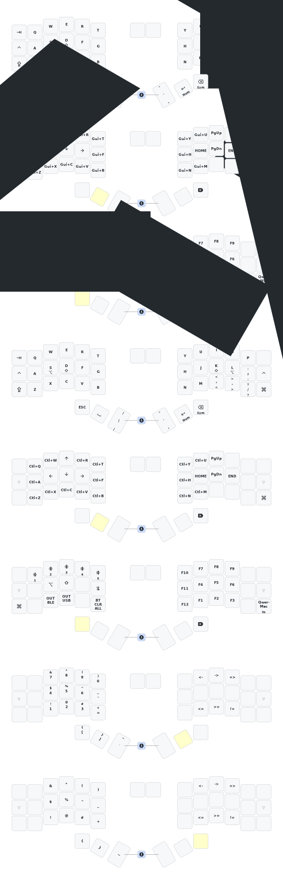

# ZMK config for tokyo2006's cygnus keyboard

> [!IMPORTANT]
>
> **Please use the [Online ZMK Editor](https://nickcoutsos.github.io/keymap-editor) to build firmware with GitHub actions.**

## Acknowledgement

- Forked from [tokyo2006/zmk-new-cygnus](https://github.com/tokyo2006/zmk-new-cygnus).
- ZMK keymap edited by [nickcoutsos/keymap-editor](https://github.com/nickcoutsos/keymap-editor).
- Keymap image generated by [caksoylar/keymap-drawer](https://github.com/caksoylar/keymap-drawer).
- Keyboard icons picked from [material design icons](https://pictogrammers.com/library/mdi/).
